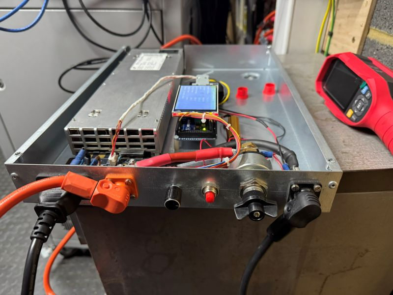
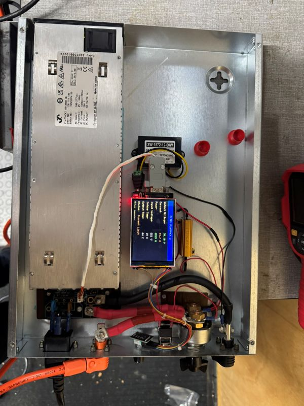
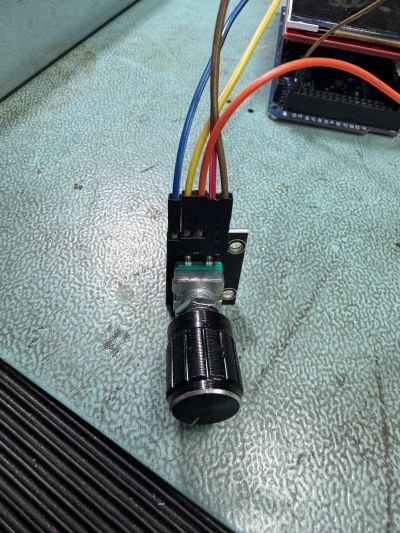
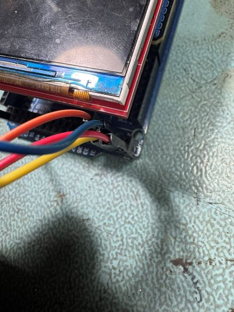

# Eltek Flatpack2 CAN Bus Power Control

**Version 1.0 - October 19, 2025**
**Author:** Eliot Mansfield - www.mez.co.uk

Control system for Eltek Flatpack2 48V power supplies using Arduino Mega 2560 with CAN bus interface and TFT display.

**[📺 Watch the Video Demo on YouTube](https://youtu.be/vlhSGeNZTTY)**





## Purpose

This controller allows me to use my petrol generator to charge Pylontech USC3000 batteries via 48V DC, providing backup power during prolonged grid failures or emergency situations.

## Warning

⚠️ **EXPERIMENTAL - Use at your own risk and modify accordingly.**
Mains voltages and Lithium batteries should be treated with extreme care.

> **Note:** This was "vibe coded" using Claude AI - I'm not a developer, therefore I recommend eye protection for any professional coders looking through this code.

## Known Issues

- The system continuously sends the permanent startup voltage back to the power supply, which could eventually wear out the flash memory
- **Workaround:** Leave the display in the voltage/current set menu to avoid constant updating

## Hardware Components

### Main Components

- **Power Supply:** Eltek FLATPACK2 48/3000 HE REV 6 (48V 3kW DC power supply)
  - Should work with most Flatpack2 revisions
- **Interface Board:** Eltek Flatpack 2HE Power Board (eBay seller: cool_as_ice0)
- **Microcontroller:** Arduino Mega2560
- **Display:** 3.5" TFT LCD Shield (MCUFRIEND_kbv compatible)
- **CAN Interface:** MCP2515 CAN Bus Shield
- **User Input:** KY-40 Rotary Encoder

### Additional Components

- Generic eBay 15-72V to 12V DC-DC Step Down Buck Converter (to power the Arduino)
- C20 Panel Mount Plug Adapter (16A)
- 50W 50Ω pre-charge resistor (prevents arcing on battery isolator during initial connection)
- Vandal Resistant Waterproof 12mm Push Button Momentary Switch (Off-On, 2A SPST) - Switch Electronics eBay shop
- Durite 0-605-1 Battery Isolator (NOTE: NOT rated for 48V...)
- AMPHENOL RadSok SurLok Plus™ 5.7mm Connectors (Pylontech style connectors) - https://servtec.co.uk/


## Wiring Instructions for Arduino Mega 2560

### MCP2515 CAN Shield

Plugs directly onto Arduino Mega (uses standard SPI pins):
- **SCK**  → Pin 52 (hardware SPI)
- **MOSI** → Pin 51 (hardware SPI)
- **MISO** → Pin 50 (hardware SPI)
- **CS**   → Pin 10 (fixed on shield)
- **INT**  → Pin 2 (not used in this code due to conflict with TFT display)

### 3.5" TFT LCD Shield (Parallel)

- Plugs on top of CAN shield
- Uses digital pins for 8-bit parallel data bus
- Auto-detected by MCUFRIEND_kbv library

### KY-040 Rotary Encoder

Use extended Mega pins above shields:
- **CLK** → Pin 22 (easy access above shields)
- **DT**  → Pin 23 (easy access above shields)
- **SW**  → Pin 24 (push button - easy access above shields)
- **+**   → 5V
- **GND** → GND

**Note:** Pins 22-24 don't have hardware interrupts, so the code uses polling for the encoder instead of interrupts.


## Features

### Display Modes

1. **Normal Mode** - Real-time monitoring display showing:
   - Output Voltage (color-coded: green if ≥46V, red if below)
   - Current (orange warning at 90% of limit)
   - Power (Watts)
   - Input Voltage
   - Intake Temperature (orange warning above 50°C)
   - Output Temperature (orange warning above 60°C)
   - Status (Normal, Walk-in Active, Current Limit, Walk-in Error)

2. **Menu Mode** - Accessible by pressing rotary encoder button:
   - Set Voltage (adjustable range: 47.5V - 51.0V)
   - Set Current (adjustable range: 20A - 50A)
   - Walk-in time (5 seconds or 60 seconds)
   - Exit to Normal View

3. **Edit Mode** - Large display for adjusting parameters:
   - Rotate encoder to adjust values
   - Press to confirm changes

### Default Settings

Based on Pylontech battery voltage levels (52.14V = 100%, 50.76V = 90%, 47.5V = 10%):
- **Default Voltage:** 47.50V
- **Default Current:** 20.0A
- **Over-Voltage Protection:** 52.0V
- **Walk-in Time:** 60 seconds (long)

### Safety Features

- Over-voltage protection (OVP) settings
- Color-coded warnings and alarms
- Real-time status monitoring
- Current limit detection
- Temperature monitoring with warnings


## Software Dependencies

### Required Arduino Libraries

```cpp
#include <mcp_can.h>        // CAN bus communication
#include <SPI.h>            // SPI communication
#include <MCUFRIEND_kbv.h>  // TFT display driver
```

Install these libraries through the Arduino Library Manager.

## Operation

1. **Power On:** System initializes CAN bus and displays startup screen
2. **Auto-Discovery:** Controller automatically detects Flatpack2 power supply
3. **Login:** Establishes communication with power supply using serial number
4. **Apply Settings:** Sends voltage and current settings to power supply
5. **Monitor:** Real-time display updates every second
6. **Adjust Settings:** Press encoder button to access menu and modify parameters

### CAN Bus Communication

- **Baud Rate:** 125 kbps
- **Periodic Login:** Re-authenticates every 40 messages
- **Settings Reapplication:** Maintains connection by periodically resending settings **(which is a bug and needs fixing to send just once)**
- **Alarm Acknowledgment:** Automatically acknowledges warnings and alarms

## CAN Bus Protocol Details

### Key Message IDs

- `0x05014400` / `0x05000000` - Power supply identification/serial number
- `0x05004804` - Login message
- `0x05FF4005` / `0x05FF4004` - Temporary settings (with/without long walk-in)
- `0x05019C00` - Permanent startup voltage (written to EEPROM once)
- `0x05014000` - Status messages (Normal, Walk-in, Current Limit, Error)
- `0x0501BFFC` - Warning/Alarm messages

### Status Codes

- `0x05014004` - Normal operation
- `0x05014008` - Current limit active
- `0x05014010` - Walk-in active
- `0x0501400C` - Walk-in error

## License

Use at your own risk. No warranty is provided. Modify as needed for your specific application.

## Safety Reminder

⚠️ This system deals with:
- **Mains voltages** - potentially lethal
- **Lithium batteries** - fire and explosion hazard if mishandled
- **High power DC** - can cause severe burns and fires

Always follow proper safety procedures and consult with qualified professionals when working with high voltage and high current systems.

---

**Support:** For questions or issues, contact via www.mez.co.uk




